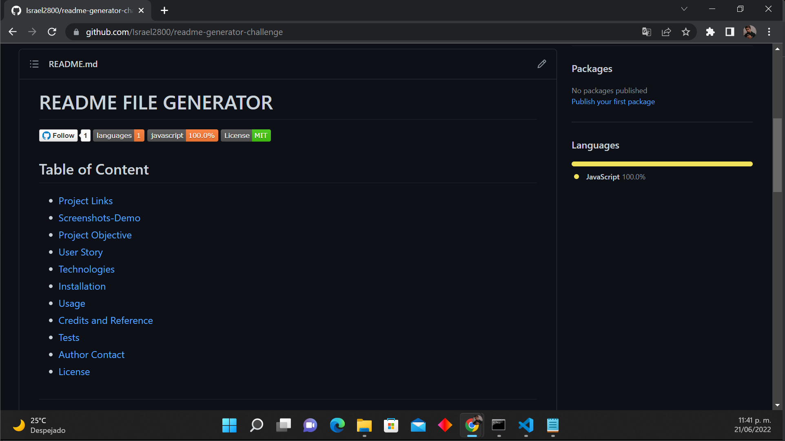

 
  # README FILE GENERATOR

  [](https://github.com/israel2800)
  [](https://github.com/israel2800/readme-generator-challenge)
  [](https://github.com/israel2800/readme-generator-challenge)
  [](https://choosealicense.com/licenses/mit/)

  ## Table of Content
  * [ Project Links ](#Project-Links)
  * [ Screenshots-Demo ](#Screenshots)
  * [ Project Objective ](#Project-Objective)
  * [ User Story ](#User-Story)
  * [ Technologies ](#Technologies)
  * [ Installation ](#Installation)
  * [ Usage ](#Usage)
  * [ Credits and Reference ](#Credits-and-Reference)
  * [ Tests ](#Tests)
  * [ Author Contact ](#Author-Contact)
  * [ License ](#License)
  #

  ##  Project Links
  https://github.com/Israel2800/readme-generator-challenge<br>
  

  ## Screenshots-Demo
  
  
  
  ## Project Objective
  Allow users to create a professional README file answering a couple of questions by the command line; with this program they will be able to organize and show the world how they create there own projects with this professional README file generator. 
  
  ## User Story
  AS A developer I want a README generator SO THAT I can quickly create a professional README for a new project.

  ## Technologies 
  ```
  Node.js, JavaScript, npm inquirer, Markdowns
  ```
  
  ## Installation
  Access to the GitHub project and clone or download the project, you can do this by clicking in the green button with the word "Code". If you decided to clone the repo you need to choose one of the SSH/HTTPS keys and copy one, after this you will need to open the terminal of your choice and type "git clone 'key'" you will need to paste one of the two keys you previously select and then click enter. If you decided to download the project you will click in the "Download.zip" option and the project will be downloaded so you will locate the file and do a right-click to select "Extract All" and you can choose where tu place it.

  ## Usage 
  To use this app you will need to download and install the terminal for mac or gitbash for windows. You may also need to install node.js and npm using the terminal. You will open the project in the code editor of your choice and then open the terminal and type "npm i inquirer" to install the dependency inquirer package. Finally you will be able to use the app typing on your terminal "node index.js" and click enter.
  
  ## Credits and Reference
  The following link helped me to add Badges: "How to Add Badges to a GitHub Repository"

  ## Tests
  npm test

  ## Author Contact
  Contact the author with any questions!<br>
  Github link: [israel2800](https://github.com/israel2800)<br>
  Email: dady281100@gmail.com

  ## License
  This project is [MIT](https://choosealicense.com/licenses/mit/) licensed.<br />

  Copyright © 2022 [ISRAEL AGUILAR](https://github.com/israel2800)
  
  <hr>
  <p align='center'><i>
  This README was generated with ❤️ by ISRAEL AGUILAR
  </i></p>
  